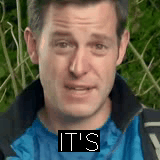

# Deep Lip Reading

This repository contains code for evaluating the best performing lip reading model described in the  paper
[Deep Lip Reading: A comparison of models and an online application](http://www.robots.ox.ac.uk/~vgg/publications/2018/Afouras18b/afouras18b.pdf).
The model is based on the Transformer architecture.

<!---
-->


Input| Crop |Enc-Dec Attention| Prediction
--|--|--|--
|| | 


## Dependencies

#### System 
* ffmpeg

#### Python 
* TensorFlow
* NumPy
* PyAV
###### Optional for visualization
* MoviePy
* Imageio-ffmpeg
* OpenCV
* TensorBoard

Recommended way to install the python dependencies is creating a new virtual environment and then running 

```
pip install -r requirements.txt
```

## Demo

To verify that everything works 
1. Run ./download_models.sh to get the pretrained models 
2. Run a simple demo

```
python main.py --lip_model_path models/lrs2_lip_model 
```

expected output:
```console
(wer=0.0) IT'S-THAT-SIMPLE --> IT'S-THAT-SIMPLE
 1/1 [================] - ETA: 0:00:00 - cer: 0.00 - wer: 0.00
```

## Visualization
To visualize the input, attention matrix and predictions set the --tb_eval flag to 1 (not supported with beam search)
```
python main.py  --lip_model_path models/lrs2_lip_model --tb_eval 1 --img_channels 3
```
Then point tensorboard to the resulting log directory
```
tensorboard --logdir=eval_tb_logs
```

## Datasets
The models have been trained and evaluated on the [LRW and LRS datasets](http://www.robots.ox.ac.uk/~vgg/data/lip_reading/) 
as well as the non-public MVLRS dataset. More details can be found in the paper.

To evaluate on [LRS2](http://www.robots.ox.ac.uk/~vgg/data/lip_reading/lrs2.html) 
download and extract the dataset into e.g. data/lrs2

For a quick evaluation on the test set without beam search run:
```
python main.py --gpu_id 0 --lip_model_path models/lrs2_lip_model --data_path data/lrs2/main --data_list media/lrs2_test_samples.txt 
```
This should take a few minutes on a GPU and result in a WER of approximately 58%.

expected output:
```console
(wer=116.7) AND-FOR-ME-THE-SURPRISE-WAS --> I-FOUND-FOR-ME-THAT-IT-IS-A-SURPRISE-RATE
   1/1243 [..............................] - ETA: 54:59 - cer: 0.6667 - wer: 1.1667
(wer=100.0) THEY'RE-MOVING-AROUND --> THEY-MOVED-IT-AROUND
   2/1243 [..............................] - ETA: 33:51 - cer: 0.5238 - wer: 1.0833
(wer=25.0) AND-WE-WERE-RIGHT --> AND-WE-WERE-READ
   3/1243 [..............................] - ETA: 26:30 - cer: 0.4276 - wer: 0.8056
(wer=100.0) AND-THE-NEXT-DAY --> IT'S-NOT-ACTUALLY
   4/1243 [..............................] - ETA: 22:40 - cer: 0.5395 - wer: 0.8542
(wer=62.5) WHEN-THERE-ISN'T-MUCH-ELSE-IN-THE-GARDEN --> WHETHER-IT'S-MUCH-HOLDING-THE-GARDEN
   5/1243 [..............................] - ETA: 21:46 - cer: 0.4916 - wer: 0.8083
                                         .
                                         .
                                         .
(wer=40.0) THESE-LAWS-WOULD-REMAIN-IN-PLACE-FOR-OVER-200-YEARS --> THESE-COURSE-WOULD-HAVE-REPLACED-FOR-OVER-200-YEARS
1239/1243 [============================>.] - ETA: 3s - cer: 0.3828 - wer: 0.5845
(wer=28.6) AS-A-RESULT-OF-THE-GUNPOWDER-PLOT --> AS-A-RESULT-OF-THE-COMPOUND-APPROACH
1240/1243 [============================>.] - ETA: 2s - cer: 0.3828 - wer: 0.5843
(wer=0.0) IT-MAY-TAKE-SOME-TIME --> IT-MAY-TAKE-SOME-TIME
1241/1243 [============================>.] - ETA: 1s - cer: 0.3824 - wer: 0.5838
(wer=0.0) YOU-KNOW-MOST-OF-IT --> YOU-KNOW-MOST-OF-IT
1242/1243 [============================>.] - ETA: 0s - cer: 0.3821 - wer: 0.5834
(wer=100.0) SO-I'LL-ASK-YOU-AGAIN --> WHEN-I-SAW-HIM
1243/1243 [==============================] - 951s 765ms/step - cer: 0.3825 - wer: 0.5837
lm=None, beam=0, bs=1, test_aug:0, horflip True: CER 0.3825, WER 0.583690

```

For the best results, run a full beam search, using the language model
and performing simple test-time augmentation in the form of horizontal flips.
```
python main.py --gpu_id 0 --lip_model_path models/lrs2_lip_model --lm_path models/lrs2_language_model --data_path data/lrs2/main --data_list media/lrs2_test_samples.txt --graph_type infer --test_aug_times 2  --beam_size 35
```
This will take a few hours to complete on a GPU and give WER of approx. 49%. 

<!---
## Visual frontend
The visual frontend can be used to extract powerful visual representaitons.
-->


## Citation
If you use this code, please cite:

```bibtex
@InProceedings{Afouras18b,
  author       = "Afouras, T. and Chung, J.~S. and Zisserman, A.",
  title        = "Deep Lip Reading: a comparison of models and an online application",
  booktitle    = "INTERSPEECH",
  year         = "2018",
}
```


## Acknowledgments
The Transformer model is based on the implementation of [Kyubyong](https://github.com/Kyubyong/transformer).

The beam search was adapted from [Tensor2Tensor](https://github.com/tensorflow/tensor2tensor/blob/master/tensor2tensor/utils/beam_search.py).

The char-RNN language model uses code from [sherjilozair](https://github.com/sherjilozair/char-rnn-tensorflow).
